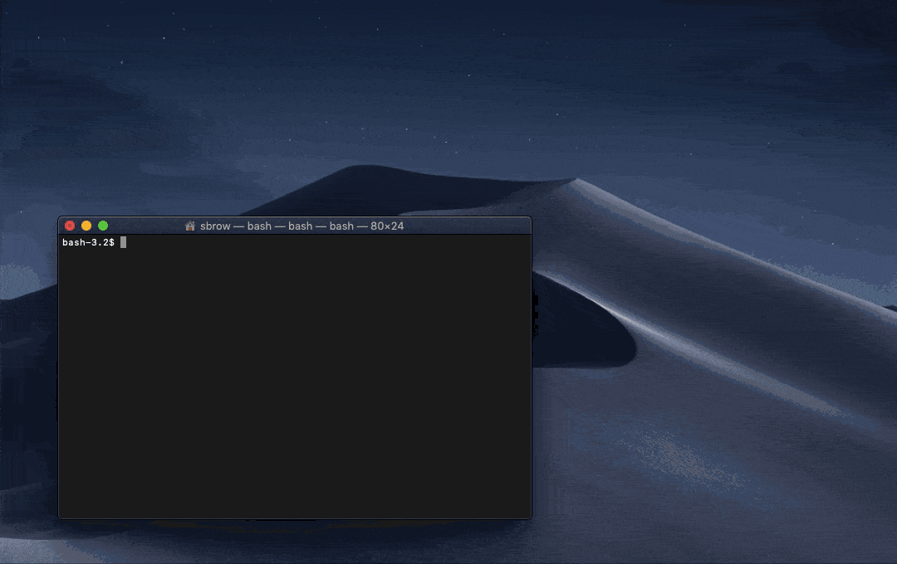

# Timer
A simple timer app that displays the time in decimal hours ([redmine](http://www.redmine.org/) friendly format).



## Installation
Make sure you have npm installed. (Get it [here](https://www.npmjs.com/get-npm))  

then, run:  
```bash
$ npm run setup
$ npm install
```

## Usage
To run in the browser:  
`$ npm start`

To run in electron:  
`$ npm start-app`